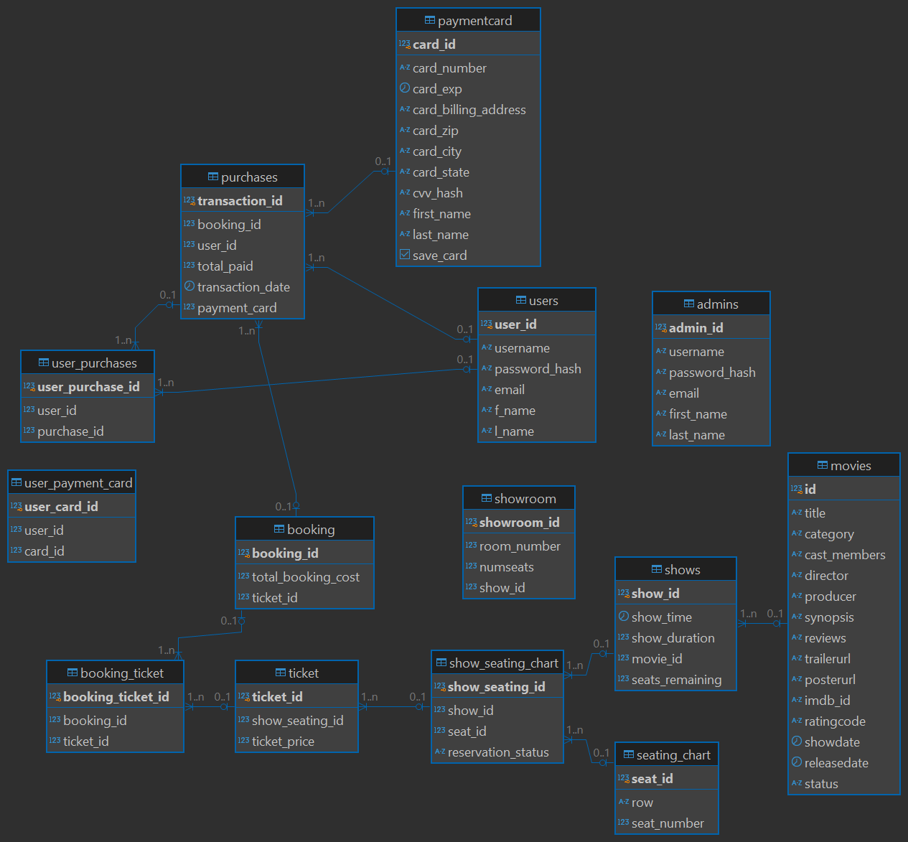

# READ FIRST  

This project was created in collaboration with three other students for my **Data Structures** class.  

We were tasked with developing a **full-stack movie theater website** where users could:  
- **Create an account** and log in.  
- **Add up to three payment cards** to their account.  
- **Browse available movies** stored in a **localized, seeded database**.  
- **Book tickets** for a specific movie showing.
- and more...

## Tech Stack  

### Frontend  
- **React** (bootstrapped with **Create React App**)  
- **Formik** & **Yup** (form handling & validation)  
- **Sass** (styling)  

### Backend  
- **Spring Boot** (server-side logic & API endpoints)  
- **Maven** (dependency management)  

### Database  
- **PostgreSQL** (**Relational Database Management System - RDBMS**)  
- **SQL** (for schema definition & queries)  
- **Seeded Local Database** (populated using:  
  - `setup_movietheater.sql` – for schema creation  
  - `seed.sql` – for inserting sample data like users, movies, showtimes, etc.)  

## Database Design   



As the primary **database architect** for this project, I focused on designing a **scalable and normalized schema** to ensure **data integrity** as the website expanded.  

In order to create the database from the ground up in a manner that would prevent any inconsistencies as the website scaled, I followed these steps:  

1. **Table Definition**  
   - Listed out tables along with their respective columns.  
   - Defined a **primary key (PK)** for each table.  

2. **Establishing Relationships**  
   - Determined **one-to-one** and **one-to-many** relationships.  
   - Referenced **foreign keys (FKs)** accordingly.   

### Entity-Relationship Diagram (ERD)  

Below, I have included the **Entity-Relationship Diagram (ERD)** for our movie theater site, depicting the various tables and how they are linked to one another.


### Explanation of the ERD  

- A **movie** is tracked by a **PK `movie_id`** and can have **one or many** showings.  
- Each showing is recorded in the `shows` table, with a **PK `show_id`** and details such as **date, time, and seating chart**.  
- The **seating chart** is linked to its respective showing via **FK `show_id`**.  

### Handling Seat Reservations  

Because each movie showing must track **seat availability**, a third **"linking table"** is required to **prevent data redundancy** and **improve scalability**.  

#### Breakdown of Related Tables:  

1. **`shows` table**  
   - Tracks each `show_id` as a particular showing of a referenced **`movie_id (FK)`**.  

2. **`seating_chart` table**  
   - Stores a **grid template** for the theater’s seating arrangement.  
   - Defines each **`seat_id`**, **row**, and **seat_number**.  
   - Example: `seat_id = 3` → Row A, Seat 3.  

3. **`show_seating` table (linking table)**  
   - Links each `show_id (FK)` with `seat_id (FK)`.  
   - Tracks **seat reservation status** (`reserved` or `open`).  

### Functionality  

- The database tracks which seats are available or reserved for a specific showing.  
- This information is displayed on the **frontend** during the **ticket booking process**.  
- Users can select available seats, complete their purchase, and the database updates the **reservation status** to ensure no double bookings.  


Further information about the tech stack, dependencies, and how to run the project can be found below. 


# Getting Started with Create React App

This project was bootstrapped with [Create React App](https://github.com/facebook/create-react-app).

## Table of Contents

- [Prerequisites](#prerequisites)
- [Installation](#installation)
  - [Frontend Setup](#frontend-setup)
  - [Backend Setup (Spring Boot)](#backend-setup-spring-boot)
  - [Setting Up the Database Locally](#setting-up-the-database-locally)
- [Available Scripts](#available-scripts)
  - [Frontend Scripts](#frontend-scripts)
  - [Backend Scripts](#backend-scripts)
- [Running the Application](#running-the-application)
  - [Running the Backend](#running-the-backend)
  - [Running the Frontend](#running-the-frontend)

## Prerequisites

Before you begin, ensure you have the following installed on your machine:

### Frontend

- **Node.js** (v14 or higher) & **npm**: [Download Node.js](https://nodejs.org/)
- **Git**: [Download Git](https://git-scm.com/downloads)

### Backend

- **Java Development Kit (JDK)** (v17 or higher): [Download JDK](https://www.oracle.com/java/technologies/javase-jdk17-downloads.html)
- **Maven** (optional, if not using the Maven wrapper): [Download Maven](https://maven.apache.org/download.cgi)
- **Git**: [Download Git](https://git-scm.com/downloads)

### Database

- **PostgreSQL**: [Download PostgreSQL](https://www.postgresql.org/download/)

## Installation

### Frontend Setup

1. **Clone the Repository**

   ```bash
   git clone https://github.com/jimmymachine/csci_4050
   cd csci_4050
   ```

2. **Navigate to the Frontend Directory**

   ```bash
   cd src
   ```

3. **Install Frontend Dependencies**

   Install the necessary dependencies, including the missing ones (`formik`, `yup`, `sass`).

   ```bash
   npm install formik yup sass
   ```

4. **Verify `package.json`**

   Ensure that `formik`, `yup`, and `sass` are listed under the `dependencies` section in your `package.json`:

   ```json
   "dependencies": {
     "formik": "^2.2.9",
     "yup": "^1.0.0",
     "sass": "^1.32.0",
     // ...other dependencies
   }
   ```

### Backend Setup (Spring Boot)

1. **Navigate to the Backend Directory**

   ```bash
   cd ../cinema-booking
   ```

2. **Install Backend Dependencies**

   Ensure you have all necessary dependencies specified in your `pom.xml`.

   **Using Maven Wrapper:**

   ```bash
   ./mvnw clean install
   ```

   **Or, if Maven is installed globally:**

   ```bash
   mvn clean install
   ```

3. **Configure Application Properties**

   Ensure that your `application.properties` is correctly configured for your environment (e.g., database settings, server port).

   **Example `application.properties`:**

   ```properties
   spring.application.name=cinema-booking
   spring.datasource.url=jdbc:postgresql://localhost:5432/ecinema_database
   spring.datasource.username=postgres
   spring.datasource.password=password
   spring.jpa.hibernate.ddl-auto=update
   spring.jpa.show-sql=true
   server.port=8081
   ```

### Setting Up the Database Locally

Setting up the PostgreSQL database locally is essential for the backend to function correctly. Follow the steps below to install, configure, and seed your database.

#### Install PostgreSQL

1. **Download and Install PostgreSQL**

   - Visit the [PostgreSQL Download Page](https://www.postgresql.org/download/) and download the appropriate installer for your operating system.

2. **Verify Installation**

   After installation, verify that PostgreSQL is running:

   ```bash
   psql --version
   ```

   This should display the installed PostgreSQL version.

#### Creating the Database

1. **Open Command Line and Navigate to the Project Directory**

   ```bash
   cd path/to/your/csci_4050
   ```

2. **Create the Database**

   Run the following command to create a new database named `movietheater`:

   ```bash
   psql -U postgres -f "database/create_database.sql"
   ```

   - **Username:** `postgres`
   - **Password:** *Enter the password you set during installation*

   **Note:** If `create_database.sql` is not in the `database/` directory, adjust the path accordingly.

#### Setting Up the Database Schema

1. **Set Up the Tables**

   Run the following command to set up the database tables:

   ```bash
   psql -U postgres -d movietheater -f "database/setup_movietheater.sql"
   ```

   - **Database:** `movietheater`
   - **Password:** *Enter the password you set during installation*

#### Seeding the Database

1. **Populate the Database with Initial Data**

   Run the following command to seed the database with initial data, including populating the `movies` table and adding an admin user:

   ```bash
   psql -U postgres -d movietheater -f "database/seed.sql"
   ```

#### Starting the Database Server

1. **Ensure Ports are Available**

   Make sure that **local ports 3000 and 3001** are free. These ports are typically used by the frontend and backend servers.

2. **Launch the Application and Database Server**

   - **Start the Frontend Application**

     Open a new terminal window, navigate to the frontend directory (`src/`), and run:

     ```bash
     npm start
     ```

3. **Verify the Setup**

   - The frontend application should be running on **[http://localhost:3000](http://localhost:3000)**.
   - The backend server should be running on **port 8081**.
   - Open the app in your browser and ensure it's communicating correctly with the backend.

#### Updating the Database

If you need to update the database structure or reseed the data, follow these steps:

1. **Navigate to the Project Directory**

   ```bash
   cd path/to/your/csci_4050
   ```

2. **Update Tables and Database Structure**

   Run the following command to apply updates to the database structure:

   ```bash
   psql -U postgres -d movietheater -f "database/setup_movietheater.sql"
   ```

   - **Password:** *Enter the password you set during installation*

3. **Reseed the Updated Database**

   Run the following command to reseed the database:

   ```bash
   psql -U postgres -d movietheater -f "database/seed.sql"
   ```

   - **Password:** *Enter the password you set during installation*

---

## Available Scripts

### Frontend Scripts

In the `src` directory, you can run:

#### `npm start`

Runs the app in the development mode.\
Open [http://localhost:3000](http://localhost:3000) to view it in your browser.

The page will reload when you make changes.\
You may also see any lint errors in the console.

#### `npm test`

Launches the test runner in the interactive watch mode.\
See the section about [running tests](https://facebook.github.io/create-react-app/docs/running-tests) for more information.

#### `npm run build`

Builds the app for production to the `build` folder.\
It correctly bundles React in production mode and optimizes the build for the best performance.

The build is minified and the filenames include the hashes.\
Your app is ready to be deployed!

See the section about [deployment](https://facebook.github.io/create-react-app/docs/deployment) for more information.

#### `npm run eject`

**Note: this is a one-way operation. Once you `eject`, you can't go back!**

If you aren't satisfied with the build tool and configuration choices, you can `eject` at any time. This command will remove the single build dependency from your project.

Instead, it will copy all the configuration files and the transitive dependencies (webpack, Babel, ESLint, etc.) right into your project so you have full control over them. All of the commands except `eject` will still work, but they will point to the copied scripts so you can tweak them. At this point, you're on your own.

You don't have to ever use `eject`. The curated feature set is suitable for small and middle deployments, and you shouldn't feel obligated to use this feature. However, we understand that this tool wouldn't be useful if you couldn't customize it when you are ready for it.

### Backend Scripts

In the `cinema-booking` directory, you can run:

#### Using Maven

##### `mvn spring-boot:run`

Runs the Spring Boot application.

##### `mvn clean install`

Cleans and builds the project.

---

## Running the Application

### Running the Backend

1. **Navigate to the Backend Directory**

   ```bash
   cd cinema-booking
   ```

2. **Start the Spring Boot Application**

   **Using Maven:**

   ```bash
   mvn spring-boot:run
   ```

   **Or, using the Maven Wrapper:**

   ```bash
   ./mvnw spring-boot:run
   ```

   The backend server should start on the configured port (`8081`). Ensure that this port matches the API endpoints used in your frontend application.

### Running the Frontend

1. **Navigate to the Frontend Directory**

   ```bash
   cd ../src
   ```

2. **Start the React Application**

   ```bash
   npm start
   ```

   Open [http://localhost:3000](http://localhost:3000) to view it in your browser. The frontend should communicate with the backend running on `http://localhost:8081` (or your configured backend port).

---

## Additional Tips

### 1. **Environment Variables**

Ensure that both frontend and backend applications have the necessary environment variables configured. For example, API endpoints, database URLs, and secret keys should be stored securely, often in `application.properties` files.

### 2. **CORS Configuration**

When running frontend and backend on different ports (e.g., `3000` and `8081` for this current setup), ensure that your Spring Boot backend is configured to handle Cross-Origin Resource Sharing (CORS).

### 3. **Database Setup**

If your Spring Boot application interacts with a database, ensure that the database is set up and running. Update your `application.properties` with the correct database connection details.

**Example `application.properties`:**

```properties
spring.datasource.url=jdbc:postgresql://localhost:5432/movietheater
spring.datasource.username=postgres
spring.datasource.password=your_password
spring.jpa.hibernate.ddl-auto=update
spring.jpa.show-sql=true
```
